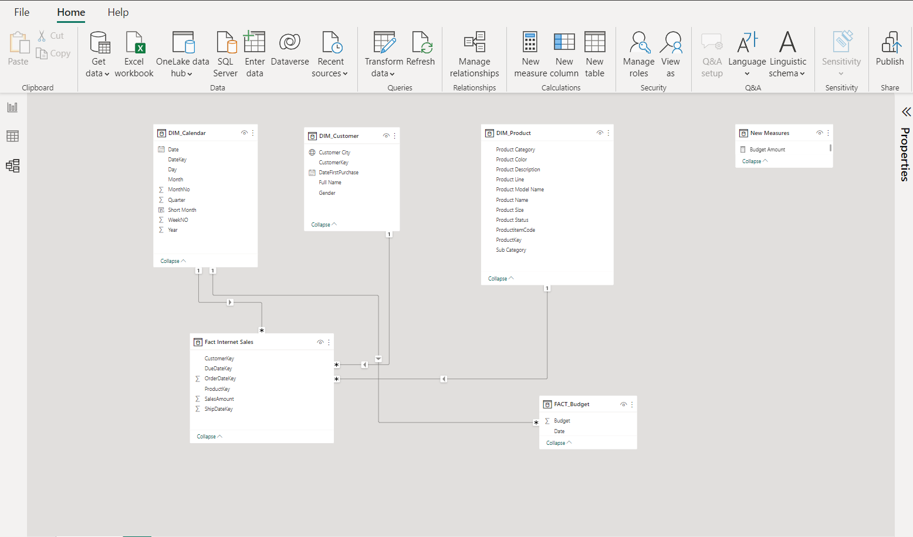

# Sales-Project-
-----
## Business Request and Users Stories ##
**_Hi Olamigoke, 
I hope you are doing well. We need to improve our Internet sales report and want to move from static reports to visual dashboards.
Essentially, we want to focus on how much we have sold off what product, to which client, and how it has been over time.
Seeing as each salesperson works on different products and customers it will be beneficial to be able to filter them also.
We measure our numbers against the budget so I added that in a spreadsheet so we can compare our value against performance.
The budget is for 2023 and we usually look 3 years back in time when we analyze sales.
Let me know if you need anything_**


## Data Source: AdventureWorksDW2019 ##

*_The business request for this project was an executive sales report for sales managers, based on the request made from the business the following user’s stories were defined to fulfill the delivery and ensure that acceptance criteria were maintained throughout the project._* 

|     NO #    |     As a(Role)                             |     I want   (Request/ Demand)                               |     So that I   (User Value)                                                                 |     Acceptance   Criteria                                                      |
|-------------|--------------------------------------------|--------------------------------------------------------------|----------------------------------------------------------------------------------------------|--------------------------------------------------------------------------------|
|     1       |     Sales Manager                          |     To get a   dashboard overview of Internet sales          |     Can follow   better which -customers and product sells the best                           |     A power bi   dashboard that updates data once a day                        |
|     2       |     Salesperson /Sales representative    |     A detailed overview of Internet sales per Customer     |     I can follow up with my customers that buy the most and to whom we can sell more to    |     A power bi dashboard that allows me to filter data for each customer.    |
|     3       |     Salesperson   /Sales representative    |     A detailed overview of Internet sales per Product      |     I can follow up with the Products that sell the most                                   |     A power bi dashboard that allows me to filter data for each Product      |
|     4       |     Sales Manager                          |     A dashboard   Overview of Internet sales                 |     Follow sales overtime against budget                                                   |    A Power bi dashboard with graphs and KPIs comparing against the budget     |


## Data Cleaning & Transformation (SQL)

_To create the necessary data model for doing analysis and fulfill the business needs defined in the user stories the following tables were extracted using SQL_
 1.	Calendar Table:  1461 rows, 8 columns 
 2.	Customer Table: 18,484 rows, 7 Columns
 3.	Product Table: 606 rows, 11 Columns
 4.	Internet_sales Table: 60384 rows, 6 Columns 

*_Below are the SQL statements for cleaning and transformation of necessary data_*

## DIM_Calendar ##
```sql
 SELECT 
  [DateKey], 
  [FullDateAlternateKey] AS Date, 
  --[DayNumberOfWeek],
  [EnglishDayNameOfWeek]AS Day, 
  --,[SpanishDayNameOfWeek]
  --,[FrenchDayNameOfWeek]
  --,[DayNumberOfMonth]
  --,[DayNumberOfYear]
  [WeekNumberOfYear]AS Weeknumber, 
  [EnglishMonthName]AS Month, 
  LEFT([EnglishMonthName], 3) AS Monthshort, 
  --,[SpanishMonthName]
  --,[FrenchMonthName]
  [MonthNumberOfYear]AS Monthnumber, 
  [CalendarQuarter]AS Quarter, 
  [CalendarYear]AS Year --,[CalendarSemester]
  --,[FiscalQuarter]
  --,[FiscalYear]
  --,[FiscalSemester]
FROM 
  [AdventureWorksDW2019].[dbo].[DimDate] 
WHERE 
  CalendarYear >= 2019;```
```
## DIM_Customer ##
```sql
SELECT 
  c.CustomerKey, 
  --[GeographyKey]
  --,[CustomerAlternateKey]
  --,[Title]
  c.FirstName, 
  --,[MiddleName]
  c.LastName, 
  c.FirstName + ' ' + lastName AS [Full Name], 
  --,[NameStyle]
  --,[BirthDate]
  --,[MaritalStatus]
  --,[Suffix]
  CASE c.[Gender] WHEN 'M' THEN 'Male' WHEN 'F' THEN 'Female' END AS Gender, 
  --,[EmailAddress]
  --,[YearlyIncome]
  -- ,[TotalChildren]
  --,[NumberChildrenAtHome]
  -- ,[EnglishEducation]
  -- ,[SpanishEducation]
  -- ,[FrenchEducation]
  --,[EnglishOccupation]
  --,[SpanishOccupation]
  -- ,[FrenchOccupation]
  --,[HouseOwnerFlag]
  -- ,[NumberCarsOwned]
  --,[AddressLine1]
  --,[AddressLine2]
  --,[Phone]
  c.DateFirstPurchase, 
  g.city AS [Customer City] -- ,[CommuteDistance]
FROM 
  [AdventureWorksDW2019].[dbo].[DimCustomer] c 
  LEFT JOIN dbo.DIMGeography g ON g.geographykey = c.geographykey 
ORDER BY 
  Customerkey ASC;```   
```
## DIM_Product ##
```sql
SELECT 
  p.[ProductKey], 
  p.[ProductAlternateKey] AS ProductitemCode, 
  --,[ProductSubcategoryKey]
  --,[WeightUnitMeasureCode]
  --,[SizeUnitMeasureCode]
  p.[EnglishProductName]AS [Product Name], 
  ps.EnglishProductSubCategoryName AS [Sub Category], 
  ---join from productsubcategory
  pc.EnglishProductCategoryName AS [Product Category], 
  ---join from productcategory
  --[SpanishProductName]
  --,[FrenchProductName]
  --,[StandardCost]
  --,[FinishedGoodsFlag]
  p.[Color]AS [Product Color], 
  -- ,[SafetyStockLevel]
  --,[ReorderPoint]
  --,[ListPrice]
  p.[Size] AS [Product Size], 
  --,[SizeRange]
  --,[Weight]
  --,[DaysToManufacture]
  p.[ProductLine] AS [Product Line], 
  --,[DealerPrice]
  --,[Class]
  --,[Style]
  p.[ModelName] AS [Product Model Name], 
  --,[LargePhoto]
  p.[EnglishDescription]AS [Product Description], 
  --,[FrenchDescription]
  --,[ChineseDescription]
  --,[ArabicDescription]
  --,[HebrewDescription]
  --,[ThaiDescription]
  --,[GermanDescription]
  --,[JapaneseDescription]
  --,[TurkishDescription]
  --,[StartDate]
  --,[EndDate]
  ISNULL(p.[Status], 'Outdated') AS [Product Status] --any product that is null in the status is outdated 
FROM 
  [AdventureWorksDW2019].[dbo].[DimProduct] p 
  LEFT JOIN dbo.DimProductSubCategory ps ON ps.productsubcategorykey = p.ProductSubcategoryKey 
  LEFT JOIN dbo.DimProductCategory pc ON ps.ProductCategoryKey = pc.ProductCategoryKey 
ORDER BY 
  p.ProductKey asc;```

```
## FACT_Internet Sales ##
```sql
SELECT [ProductKey]
      ,[OrderDateKey]
      ,[DueDateKey]
      ,[ShipDateKey]
      ,[CustomerKey]
      --,[PromotionKey]
      --,[CurrencyKey]
      --,[SalesTerritoryKey]
      --,[SalesOrderNumber]
      --,[SalesOrderLineNumber]
      --,[RevisionNumber]
      --,[OrderQuantity]
     -- ,[UnitPrice]
      --,[ExtendedAmount]
      --,[UnitPriceDiscountPct]
      --,[DiscountAmount]
      --,[ProductStandardCost]
      --,[TotalProductCost]
      ,[SalesAmount]
      --,[TaxAmt]
      --,[Freight]
      --,[CarrierTrackingNumber]
      --,[CustomerPONumber]
      --,[OrderDate]
      --,[DueDate]
      --,[ShipDate]
  FROM [AdventureWorksDW2019].[dbo].[FactInternetSales]
  WHERE
 LEFT (OrderDateKey,4) >= YEAR(GETDATE())-3 --Ensure we only bring 3 years of date from extraction
 ORDER BY 
 OrderDateKey ASC;```
```
## FACT_SalesBudget ##
*_This came from a different Data source (Microsoft Excel)_*

| Date      | Budget  |
|-----------|---------|
| 1/1/2020  | 800000  |
| 2/1/2020  | 800000  |
| 3/1/2020  | 1000000 |
| 4/1/2020  | 1000000 |
| 5/1/2020  | 1100000 |
| 6/1/2020  | 1100000 |
| 7/1/2020  | 1500000 |
| 8/1/2020  | 1500000 |
| 9/1/2020  | 1500000 |
| 10/1/2020 | 1500000 |
| 11/1/2020 | 1500000 |
| 12/1/2020 | 2000000 |
| 1/1/2021  | 800000  |
| 2/1/2021  | 800000  |
| 3/1/2021  | 1000000 |
| 4/1/2021  | 1000000 |
| 5/1/2021  | 1100000 |
| 6/1/2021  | 1100000 |
| 7/1/2021  | 800000  |
| 8/1/2021  | 800000  |
| 9/1/2021  | 1000000 |
| 10/1/2021 | 1000000 |
| 11/1/2021 | 1100000 |
| 12/1/2021 | 1100000 |
| 1/1/2022  | 1500000 |
| 2/1/2022  | 1500000 |
| 3/1/2022  | 1500000 |
| 4/1/2022  | 1500000 |
| 5/1/2022  | 1500000 |
| 6/1/2022  | 2000000 |
| 7/1/2022  | 800000  |
| 8/1/2022  | 800000  |
| 9/1/2022  | 1000000 |
| 10/1/2022 | 1000000 |
| 11/1/2022 | 1100000 |
| 12/1/2022 | 1100000 |
| 1/1/2023  | 800000  |
| 2/1/2023  | 800000  |
| 3/1/2023  | 1000000 |
| 4/1/2023  | 1000000 |
| 5/1/2023  | 1100000 |
| 6/1/2023  | 1100000 |
| 7/1/2023  | 1500000 |
| 8/1/2023  | 1500000 |
| 9/1/2023  | 1500000 |
| 10/1/2023 | 1500000 |
| 11/1/2023 | 1500000 |
| 12/1/2023 | 2000000 |

## Data Model ##
**_Snowflakes Schema model_** 


## Dashboard ##
